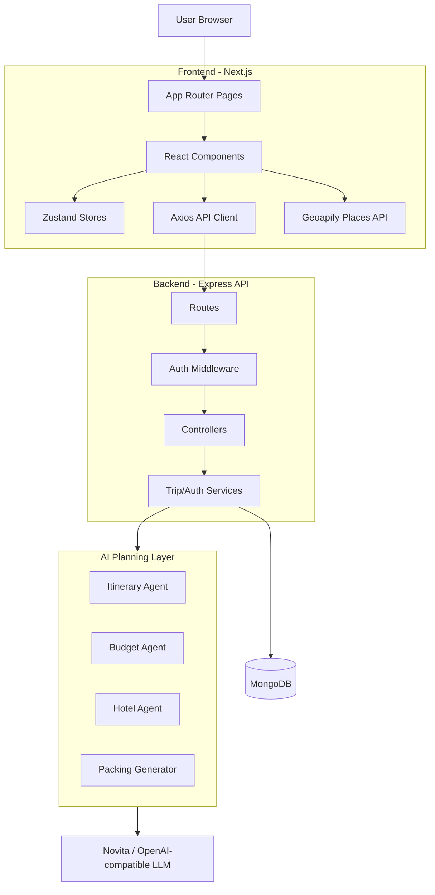

# Voyai - AI Travel Planner

## Project Overview

Voyai is a full-stack AI travel planner. Users enter a destination, trip length, budget, and interests, then get a saved trip with an itinerary, budget estimate, hotel suggestions, and packing list.

The main idea is to make AI trip output usable after generation: trips are stored per user, can be edited, and include practical planning tools instead of only a one-time text response.

## Tech Stack

| Area | Stack |
| --- | --- |
| Frontend | Next.js 14, React, TypeScript, Tailwind CSS |
| Backend | Node.js, Express, TypeScript |
| Database | MongoDB, Mongoose |
| Auth | JWT, HTTP-only refresh cookie, bcrypt |
| AI | Novita OpenAI-compatible API, OpenAI SDK |
| State & Forms | Zustand, React Hook Form, Zod |
| External APIs | Geoapify Places Autocomplete |

## Setup Instructions

### Local Backend

```bash
cd backend
cp .env.example .env
npm install
npm start
```

Use `backend/.env.example` as the reference for required variables.

The backend runs at `http://localhost:5000`, with API routes under `http://localhost:5000/api`. A quick health check is available at `http://localhost:5000/health`.

### Local Frontend

```bash
cd frontend
cp .env.local.example .env.local
npm install
npm run dev
```

Use `frontend/.env.local.example` as the reference for required variables.

The frontend runs at `http://localhost:3000`.

## High-Level Architecture



The frontend handles screens, forms, client state, and API calls. The Express backend owns authentication, validation, trip CRUD, AI orchestration, and persistence. MongoDB stores users and trips, while external APIs are used only where needed: Novita for AI planning and Geoapify for place autocomplete.

## Authentication and Authorization

Voyai uses email/password auth with bcrypt-hashed passwords.

- Login/register returns a short-lived JWT access token.
- A refresh token is kept in an HTTP-only cookie so users do not have to log in repeatedly.
- Protected API routes require a bearer token, and the frontend retries once after refreshing an expired access token.
- Trip access is scoped by `userId`, so users can only read, update, or delete their own trips.
- Next.js middleware handles basic protected-route redirects, but the backend is the real authorization layer.

## AI Agent Design and Purpose

The AI part is split into focused travel agents instead of one giant prompt:

- **Itinerary agent:** builds day-by-day activities around destination, trip length, interests, and budget.
- **Budget agent:** estimates transport, stay, food, activities, miscellaneous cost, and total.
- **Hotel agent:** suggests 3-5 stay options that match the destination and budget tier.
- **Day regeneration agent:** rewrites one selected day using the user's custom instruction.
- **Packing generator:** creates a deterministic checklist from destination, season, interests, and activities.

LLM outputs are requested as JSON, validated with Zod, and repaired if needed before saving, so the UI gets structured data instead of raw text.

## Creative / Custom Feature

The custom feature is the smart packing list. It uses the destination, season, interests, trip length, and itinerary activities to suggest practical items instead of a generic checklist.

It also works like a real packing tool: items are grouped by category, users can check things off, track progress, reset the list, and copy it to the clipboard.

## Key Design Decisions and Trade-Offs

- I kept the frontend and backend separate so auth, database access, and AI calls stay on the server. The trade-off is a little more deployment/CORS setup.
- Trips are saved after generation instead of being treated as one-time AI output. That makes the app faster to revisit and edit, but prices and suggestions can become stale over time.
- AI responses are forced through JSON schemas before being stored. This adds extra code, but it keeps broken model output from crashing the UI.
- The packing list is rule-based instead of fully AI-generated. That makes it fast, predictable, and cheap, but less imaginative than another model call.

## Known Limitations

- Budgets, hotels, and itineraries are AI estimates, not live booking data.
- There are no map, weather, transport, or payment integrations yet.
- Trips are private to one user; there is no sharing or collaboration flow.
- Refresh tokens are not stored server-side for forced revocation, so they rely on expiry and cookie clearing.
